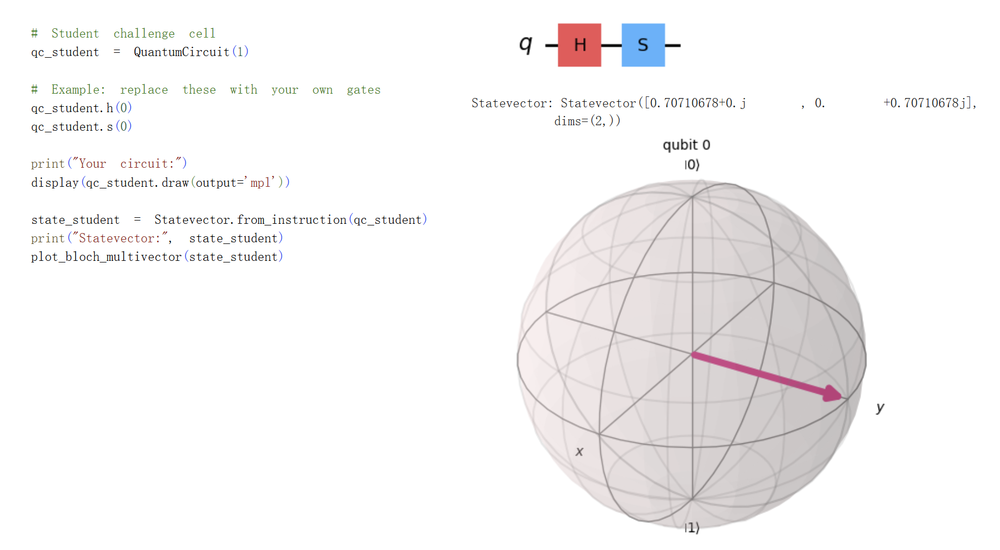

# Student mini-challenge

Create your own one-qubit circuit using any combination of:
- `h`
- `x`
- `y`
- `z`
- `s`
- `t`

## Your task
1. Build a circuit with at least **two gates**.
- Code, histogram and Bloch Sphere, see 
2. Predict the Bloch Sphere position before running it.
3. Plot the Bloch Sphere.
4. Write a 3 to 5 line explanation of what happened.
- H: Rotate 90 degrees counterclockwise about the y-axis
- X: Rotate 180 degrees counterclockwise about the x-axis
- Y: Rotate 180 degrees counterclockwise about the y-axis
- Z: Rotate 180 degrees counterclockwise about the z-axis
- S: Rotate 90 degrees counterclockwise about the z-axis
- T: Rotate 45 degrees counterclockwise about the z-axis

# Reflection questions
Write short answers for the following:

## What is the difference between a classical bit and a qubit?
- Classical bit is either 0 or 1 while a qubit can be in superposition with probablity of 0 and 1
## What does the Hadamard gate do?
- Turn a qubit with initial state into superposition or turn it back to initial state
## How is an entangled state different from two independent qubits in superposition?
- Qubit in entangled state can affect the other qubit
## What does the Bloch Sphere help us understand?
- Understand amplitude and phase of 1 qubit and how the gates affect the amplitude and phase.
## Which part of today's lab did you find the most interesting or confusing?
- Bloch Sphere is an amazing tool for qubit understanding
