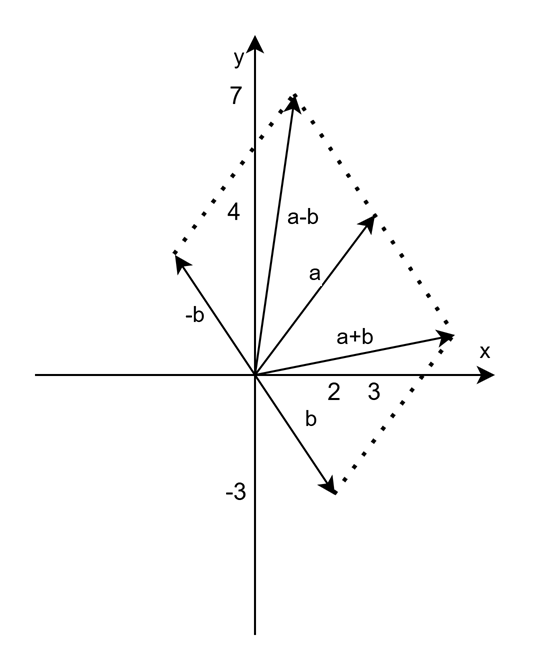

# Student mini-challenge

## Task 9
Create your own **one-qubit** circuit using one or more of the following gates:

- `x`
- `y`
- `z`
- `h`
- `s`
- `t`

## Describe

### the gates you used
- h, s, x
### what you predicted
- First rotate 90 degree counterclockwise around z-axis to positive y-axis, then rotates 180 degree around x-axis to negative y-axis
### what actually happened
- Same as I thought
### whether the result matched your expectation
- Yes

# Part 13: Final summary questions
Answer the following in your own words:

## What does the Bloch Sphere help us visualize?
- A single qubit state conversion
## What is the difference between basis states and superposition states on the sphere?
- basis states are on the poles, both theta and phi are 0 degree, while supserposition states have theta angle 90 degree.
## Which gate in this activity caused a clear flip between poles?
- x gate
## Which gate sequence helped you understand phase?
- z, s, t gates
## Why is the Bloch Sphere mainly useful for single-qubit states?
- Bloch Sphere is in 3-D space which exactly match the dimensions of 1 qubit vector.

# complex number

## visualize 2 complex numbers, including addition and substraction
- Assume 2 complex numbers
* a = 3+4i
* b = 2-3i
* a+b = 5+i
* a-b = 1+7i
- The visualization on cordination: 
## convert between Cartesian coordination and polar coordination
- a = 3+4i
* Cartesian: [3, 4]
* Polar:     [5, arctan(4/3)]
- b = 2-3i
* Cartesian: [2, -3]
* Polar:     [√13, arctan(-3/2)]
